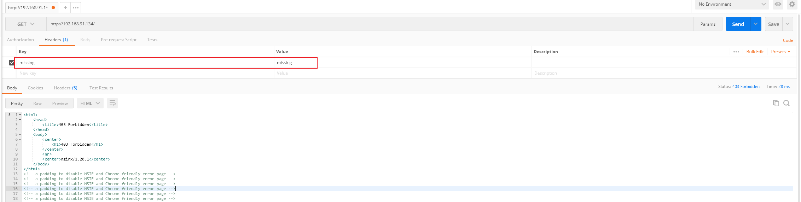
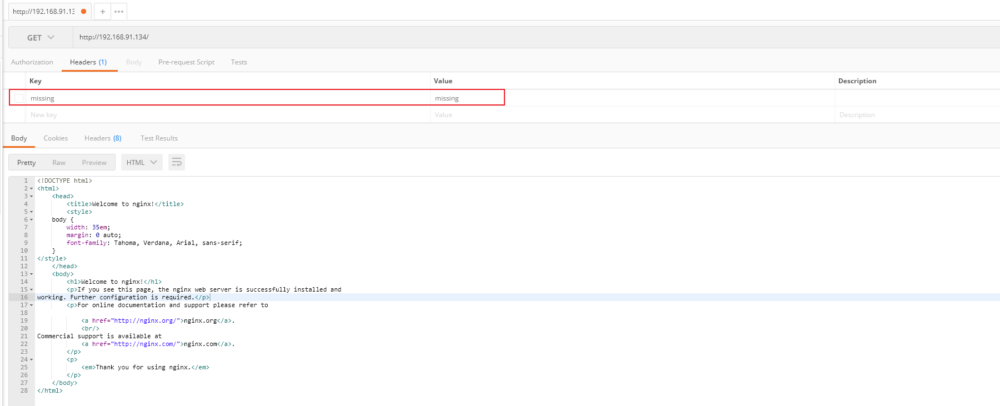

# reverse_detect
reverse_detect 是一个基于 nginx 做反向代理的，使用 suricata 做攻击检测拦截。

# 背景
在开源的项目中没有找到一款合适的用于web检测的项目，要么就是类似于单机防火墙的形态，要想提升性能只能靠更高的cpu，内存来怼，所以基于nginx + suricata 希望后续往分布式waf方向前进，基于这个原则，将转发 跟 检测 分开，支撑横向扩展。

# 拦击检测测试
这里是一条简单的规则 ，目的是拦截 http 请求头中带有 missing 的请求。
```
alert http any any -> any any (msg:"header contain bad word!"; flow:to_server;  content:"missing"; http_header; sid:1;)
```

### 测试拦截
现在发送带有missing的http头

可以看到请求被拦截下来了。

### 测试不拦截
现在发送不带missing的头

可以看到能够正常访问。

# TODO
- [x] web请求检测
- [ ] web回复检测 -- 可能不会做，没啥意义。
- [ ] 攻击日志记录
- [ ] 前端界面可配置
- [ ] 补齐其他缺少的功能
- [ ] 一键部署
- [ ] 分布式 & 容器化
